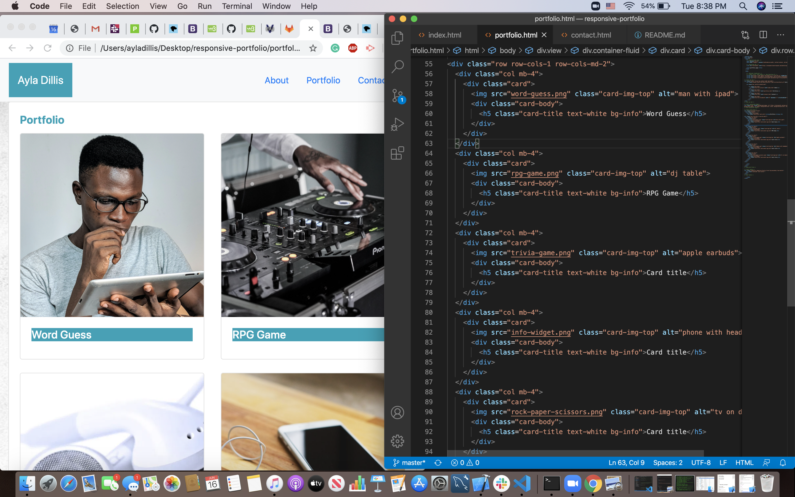

# *bold* Responsive Portfolio

The purpous of this project was to create three index.html pages; a contact page, portfolio page and an about me page. 

## CSS and Bootstrap Responsive Portfolio

Bootstrap was the only formating tool I used to create all three pages, I was able to generate a responsive layout, navbar and grid image all using code taken from the Bootstrap website. What I enjoyed most about this project was gaining confidence in my own ability to problem solve as well as making connections with my peers in Bootcamp as while we all collectively worked through the Responsive Portfolio together. What I liked least about this project was trying to think around how to resize the web pages to fit different window sizes. Regardless I found this project fufilling and fun!

### *bold, italic* Tools 

* Zoom 
* Slack
* Google
* Youtube
* w3School
* My peers :)

## *bold, italic* Code Examples 

1. Inorder to create the same gray colored background from the example pages I took a gray square image from Google Images and set is as the background for all three of my pages, this worked alright however I wasn't able to ger the background image to fill up the whole area of the site. 

<!--start background iamge-->
< div class="view" style="background-image: url('https://chiprewards.com/wp-content/uploads/2017/12/Light-Gray-background.png'); 
background-repeat: no-repeat; background-size: cover; background-position: center center;">
<!--end background image-->

2. to get my Portfolio page boxes all set on one card I set up this code before codying the 'Grid Cards' from Bootstrap. 

< div class="container-fluid">
  < div class="card">
    < div class="card-body">
      < h5 class="card-title text-info">< strong>Portfolio</ strong></ h5>

## *bold, italic* Screenshots
 
Inorder to format the Portfolio page correctly I had to screentshot the pictures I wanted off of Google Images then crop them into perfect squares and radjusted the size so the width was 640px and the height 640px as well. Finally I inserted them into the image tag of my Portfolio page. 

## *bold, italic* Deploy Link

* [See Live Site](https://ayladillis.github.io/responsive-portfolio/)

## *bold, italic* Authors

Ayla Dillis

* [HTML](https://developer.mozilla.org/en-US/docs/Web/HTML)
* [CSS]((https://developer.mozilla.org/en-US/docs/Web/CSS)
* [Javascript](https://developer.mozilla.org/en-US/docs/Web/JavaScrip)
* [Bootstrap](https://getbootstrap.com/)
* [Responsive Portfolio](https://github.com/ayladillis/responsive-portfolio)

